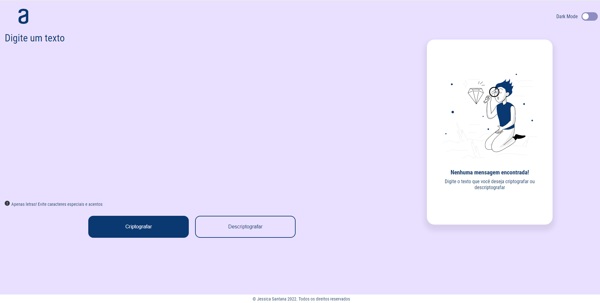
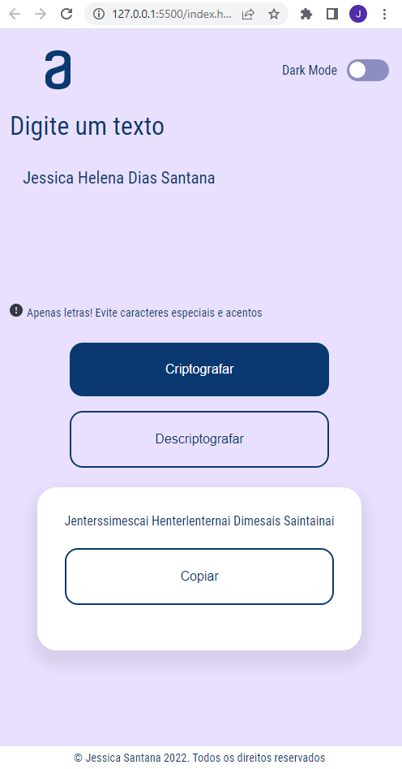
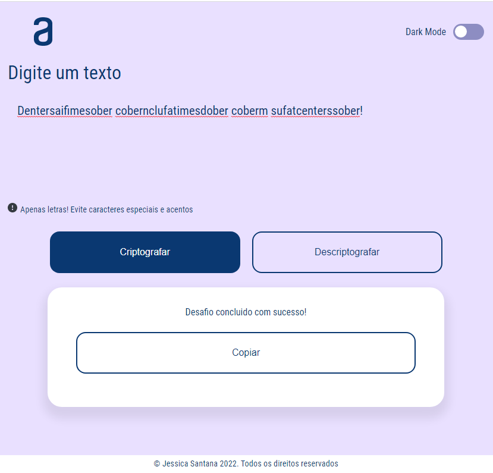
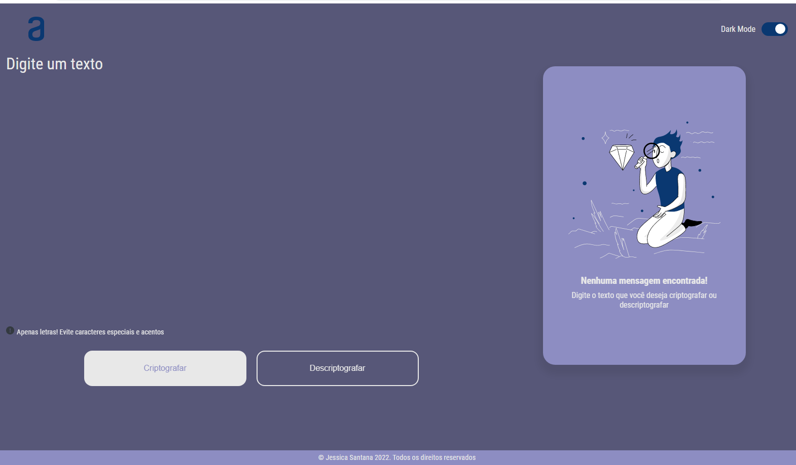
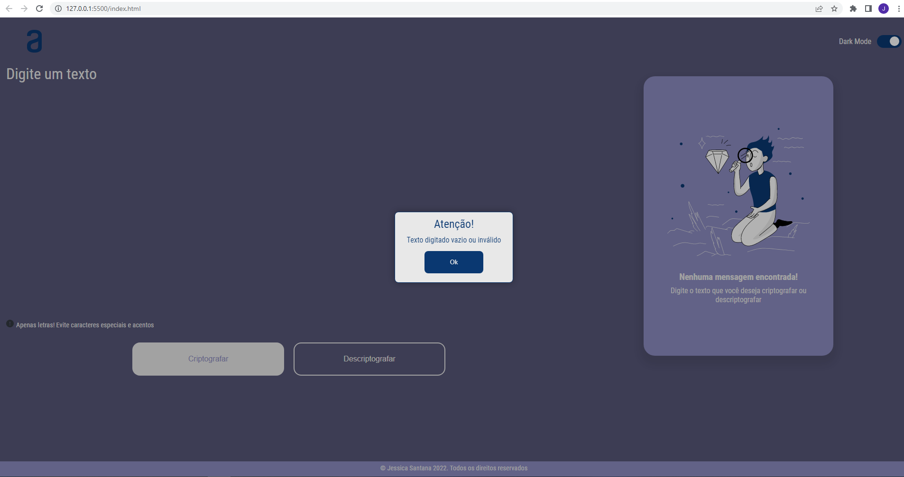
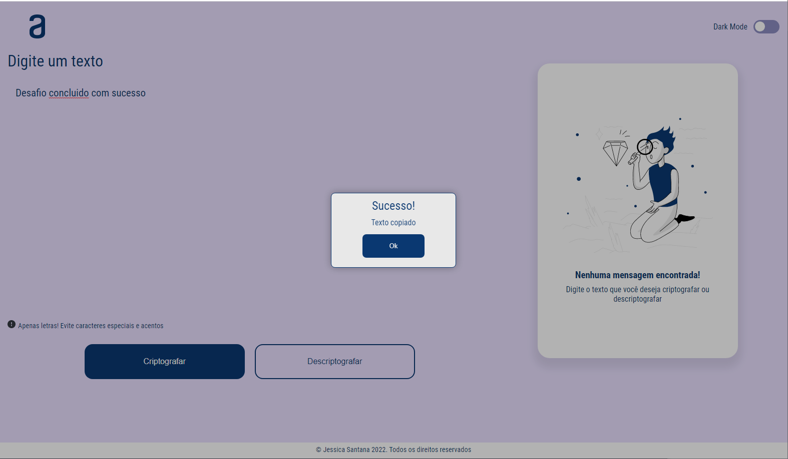

# Desafio de Criptografia de Textos - ONE - Turma 4

**Desafio proposto:** Criar uma aplicação responsiva, que criptografasse e descriptografasse textos seguindo uma regra pré-definida.

**Funcionalidades extras:** 
- Botão copiar
- Modal para exibir mensagens ao usuário
- Dark mode

### Tecnologias utilizadas:

  
 
 
 

### Resultado final

Teste a aplicação! Acesse o [link](https://djehsantana.github.io/desafio-criptografia-one/)! 

**Layout da aplicação nos tamanhos de tela:**
Tela Desktop

Tela Mobile:

Tela Tablet:

**Funcionalidades extras:**
Dark Mode:

Validação de área de texto vazia:

Mensagem exibida após texto copiado:

**Gostou do projeto?**
Me siga no [Linkedin](https://www.linkedin.com/in/jessica-santana-developer/)!

